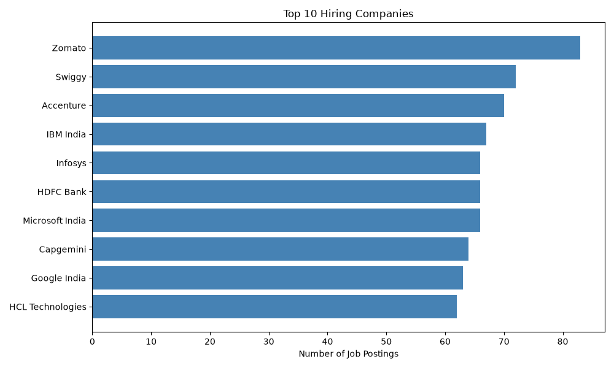
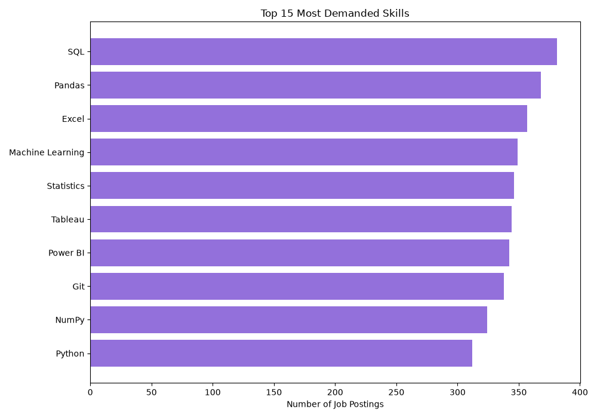
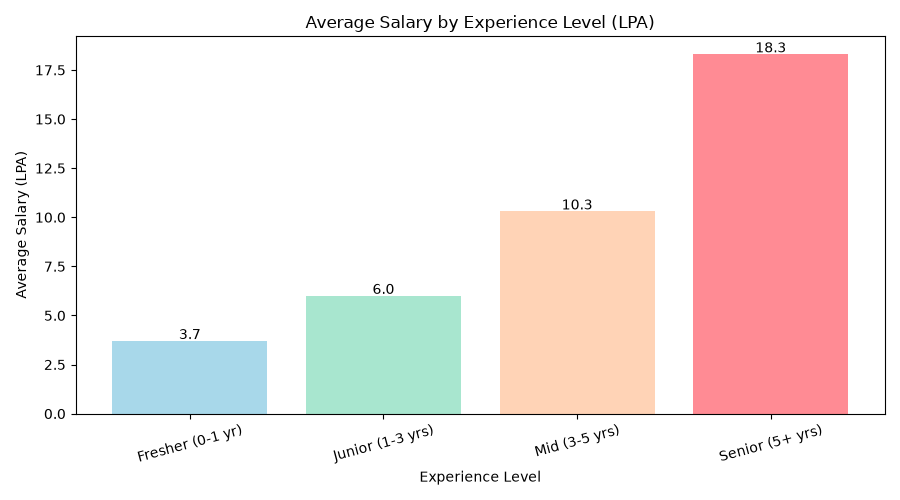
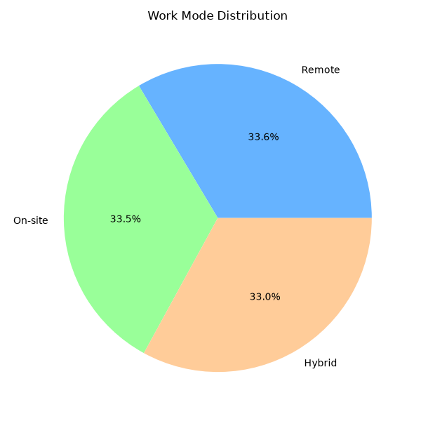

# Job Market Analytics Dashboard

**Tools:** Python | Pandas | Matplotlib | SQL | Excel

---

## About this project

I am a fresher learning data analytics and I built this project to practice the skills I have been learning — Python, SQL, and Excel.

The idea was simple: instead of doing random practice exercises, I wanted to work on something that actually makes sense. So I decided to analyse job postings in the data field and find out what companies are looking for, which cities have more jobs, and how salary changes with experience.

This helped me understand the job market while also practising data cleaning, analysis, and visualisation at the same time.

---

## Questions I tried to answer

- Which cities have the most data jobs?
- Which companies are hiring the most?
- What skills do most job postings ask for?
- How much does salary change with experience?
- How many fresher jobs are available?
- Are remote jobs common?

---

## Project Structure

```
Job-Market-Analytics/
│
├── dataset/              → Raw data (jobs_raw.csv)
├── cleaned_data/         → Cleaned data (cleaned_jobs.csv)
│
├── python/
│   ├── 01_generate_sample_data.py   → Creates the dataset
│   ├── 02_data_cleaning.py          → Cleans the raw data
│   ├── 03_eda_analysis.py           → Creates charts
│   ├── 04_business_insights.py      → Prints key findings
│   └── 05_export_for_excel.py       → Exports to Excel
│
├── sql/
│   ├── 01_create_tables.sql         → Creates MySQL table
│   ├── 02_analysis_queries.sql      → Business queries
│   └── 03_advanced_queries.sql      → Advanced SQL practice
│
├── excel/
│   └── job_market_dashboard.xlsx    → Excel dashboard
│
├── images/               → Charts saved as images
└── README.md
```

---

## What I did step by step

**Step 1 — Created the dataset**

Since I am a fresher I did not have access to a paid dataset, so I created my own using Python. I wrote a script that generates 1000 job postings with fields like job title, company, city, skills, salary, and work mode. I also added some duplicate rows and lowercase city names on purpose so I had something realistic to clean.

**Step 2 — Cleaned the data**

This was the most important step I feel. Real data is never clean. I used Pandas to:
- Find and remove 30 duplicate rows
- Fix city names that were in lowercase (bangalore → Bangalore)
- Fill in missing salary values using the average salary of that experience group
- Convert the date column from text to proper date format

**Step 3 — Made charts**

I used Matplotlib to create 10 charts to answer my questions visually. I made bar charts, a pie chart, a histogram, and a line chart. Each chart answers one specific question.

**Step 4 — Found insights**

I wrote a script that calculates and prints the key findings from the data — like which city has the most jobs, what percentage of postings are for freshers, and how salary grows with experience.

**Step 5 — Excel dashboard**

I exported the cleaned data and summary tables to Excel and built a simple dashboard with charts and KPIs like Total Jobs, Average Salary, and Top Skill.

**Step 6 — SQL practice**

I imported the data into MySQL and practised writing queries. I started with basic SELECT and GROUP BY queries and then moved on to subqueries and CTEs.

---

## What I found

- Around **25% of job postings** are open to freshers — which is more than I expected
- **SQL and Python** are the most asked skills in almost every posting
- Salary grows a lot with experience — from around **3.7 LPA** for freshers to **18 LPA** for seniors
- **Hybrid work** is the most common work mode right now
- Most hiring happens around **June and July**

---

## Charts






---

## How to run

```bash
pip install pandas matplotlib openpyxl
```

```bash
cd python
py 01_generate_sample_data.py
py 02_data_cleaning.py
py 03_eda_analysis.py
py 04_business_insights.py
py 05_export_for_excel.py
```

For SQL — open MySQL Workbench, run `sql/01_create_tables.sql`, import the CSV, then run the query files.

---

## Skills I used

- Python — for writing all the scripts
- Pandas — for loading, cleaning and analysing the data
- Matplotlib — for creating charts
- SQL — for querying the data in MySQL
- Excel — for building the dashboard
